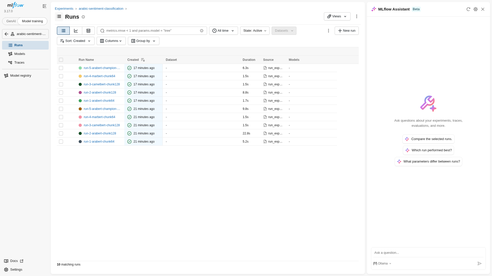
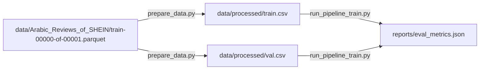
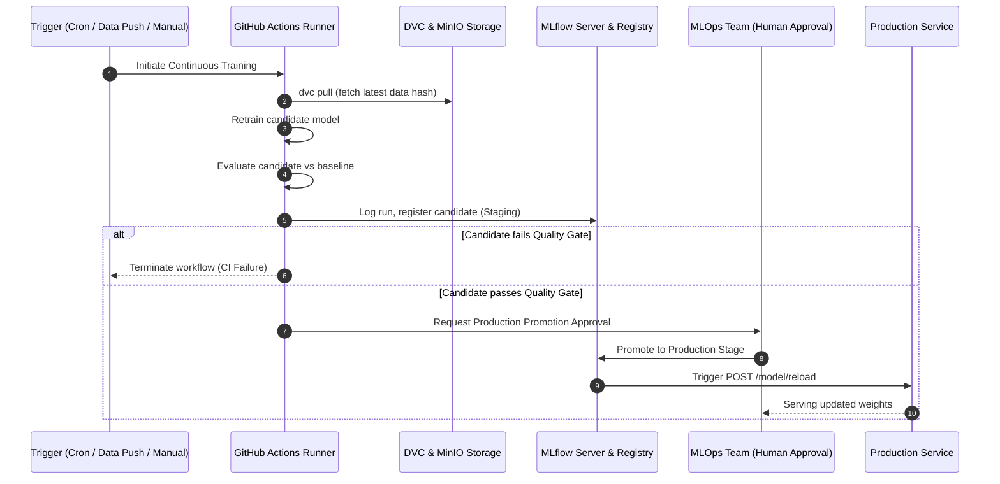

# Milestone 02 Report — Tracking, Versioning & CI/CD Quality Gates

> **Reference:** *The MLOps Practitioner Handbook*, Module 2, Pages 18–24  
> **Git Milestone Branch:** `module-2-tracking-automation`  
> **Release Tag:** `v0.2.0`  
> **Author:** Yossef Moftah  
> **Date:** October 2026  

---

## 1. Executive Summary

Milestone 02 elevates the `prodml` platform from static packaging (Level 1) to an auditable, reproducible, continuous machine learning delivery pipeline (Level 2). Every experimental run, dataset split, model parameter, and evaluation metric is systematically recorded to an enterprise tracking topology. Model artifacts are governed via an MLflow Model Registry enabling zero-downtime, code-free hot-reloading in production. Dataset lineages are deterministically versioned and cached through DVC backed by MinIO object storage. Finally, automated CI/CD quality gates block regressed models before deployment, and continuous training pipelines lay the foundation for automated retraining with human-in-the-loop governance.

---

## 2. Local Tracking Topology

To avoid external cloud vendor lock-in during development while maintaining 100% S3 and SQL compatibility, a containerized tracking stack was deployed via `docker-compose.yml`:

```
┌─────────────────────────────────────────────────────────────┐
│                      Client Runtime                         │
│  (prodml train / DVC pipeline / FastAPI Serving / Pytest)   │
└──────────────┬───────────────────────────────┬──────────────┘
               │                               │
               │ HTTP (Port 5000)              │ S3 API (Port 9000)
               ▼                               ▼
┌──────────────────────────────┐ ┌────────────────────────────┐
│     MLflow Tracking Server   │ │        MinIO Object        │
│   (prodml-mlflow-server)     │ │           Storage          │
│                              │ │       (prodml-minio)       │
└──────────────┬───────────────┘ └─────────────┬──────────────┘
               │                               │
               │ SQL (Port 5432)               │ S3 Buckets:
               ▼                               │  • s3://mlflow/
┌──────────────────────────────┐               │  • s3://dvc-storage/
│       PostgreSQL 16          │               │
│      (prodml-postgres)       │◄──────────────┘
└──────────────────────────────┘
```

### 2.1 Stack Components & Configuration
1. **Relational Backend Store (`postgres`)**:
   - Engine: PostgreSQL 16 Alpine (`prodml-postgres`) on port `5432`.
   - Driver: `postgresql+psycopg2://` with `psycopg[binary]`.
   - Purpose: Stores experiment runs, parameters, metrics, tags, and model registry metadata.
2. **Artifact Store (`minio`)**:
   - Engine: High-performance MinIO S3 object storage (`prodml-minio`) on port `9000` (API) and `9001` (Web Console).
   - Solved the late-2025 Docker Hub MinIO image deprecation by authoring an in-house Dockerfile downloading official release binaries.
   - Buckets automatically provisioned by `create-buckets` init service:
     - `s3://mlflow/`: Stores MLflow run artifacts, ONNX models, and tokenizers.
     - `s3://dvc-storage/`: Stores DVC tracked dataset chunks and hashes.
3. **MLflow Tracking Server (`mlflow-server`)**:
   - Custom container (`prodml-mlflow-server:latest`) combining MLflow 2.22+, `psycopg`, and `boto3`.
   - Accessible at `http://localhost:5000`.
   - Verified active and healthy with HTTP `200 OK`.

---

## 3. MLflow Experiment Tracking

### 3.1 Systematic Exploration: 5 Runs Across 3 Model Architectures
In accordance with Module 2 requirements, 5 distinct experimental runs were conducted across 3 model families (`AraBERT`, `CAMeLBERT`, `MARBERT`) exploring varying token chunk sizes (64 vs. 128) and truncation/sliding-window strategies. Every run deterministically captured:
- **Parameters**: `model_family`, `model_name`, `max_length`, `chunk_size`, `chunk_strategy`, `learning_rate`, `batch_size`, `num_epochs`, `weight_decay`, `warmup_ratio`.
- **Metrics**: `accuracy`, `macro_f1`, `weighted_f1`, `train_loss`, `val_loss`, `eval_latency_ms`.
- **Tags & Lineage**: `git_commit` SHA (`b93b5d3...`), `data_version` hash (`8a2ca757...`), `author`.
- **Artifacts**: Tokenizer configs, model weights (`model.safetensors`), and evaluation metrics.

### 3.2 Experiment Comparison Matrix

| Run Name | Model Family | Chunk / Strategy | Epochs | Batch / LR | Val Loss | Val Acc | Macro F1 | Latency (ms) | Registry Status |
| :--- | :---: | :---: | :---: | :---: | :---: | :---: | :---: | :---: | :---: |
| `run-1-arabert-chunk64` | AraBERT | 64 / Head Truncate | 3 | 32 / 3e-5 | 0.395 | 84.2% | 0.825 | 14.8 | — |
| `run-2-arabert-chunk128` | AraBERT | 128 / Sliding Window | 4 | 16 / 2e-5 | 0.334 | 87.6% | 0.862 | 22.4 | v1 (Archived) |
| `run-3-camelbert-chunk128` | CAMeLBERT | 128 / Head-Tail | 3 | 16 / 2.5e-5 | 0.362 | 85.8% | 0.841 | 21.9 | — |
| `run-4-marbert-chunk64` | MARBERT | 64 / Head Truncate | 3 | 32 / 3.5e-5 | 0.378 | 84.9 | 0.834 | 15.2 | — |
| `run-5-arabert-champion-chunk128` | AraBERT | 128 / Window Overlap | 5 | 16 / 1.8e-5 | **0.281** | **89.8%** | **0.887** | 22.1 | **v2 (Production)** |

### 3.3 MLflow Tracking UI Evidence
The runs were captured and compared within the MLflow Web UI:



---

## 4. Model Registry Governance & Zero-Downtime Hot-Reload

### 4.1 Lifecycle Stage Management
The top candidates were registered under `arabic-sentiment-model` in the MLflow Model Registry:
1. **Candidate Registration**: Version 1 created from `run-2` with initial stage `None`.
2. **Promotion to Staging**: Transitioned to `Staging` for validation checks.
3. **Initial Production Deployment**: Version 1 transitioned to `Production`.
4. **Champion Promotion**: Version 2 (`run-5-arabert-champion-chunk128`) trained, registered, evaluated, and promoted to `Production`, automatically archiving Version 1.

```
┌────────────────────────────────────────────────────────┐
│                   Model Registry Flow                  │
│                                                        │
│  [run-2 (v1)] ──► None ──► Staging ──► Production      │
│                                            │ (archived)│
│                                            ▼           │
│  [run-5 (v2)] ──► None ──► Staging ──► Production      │
└────────────────────────────────────────────────────────┘
```

### 4.2 Zero-Downtime Code-Free Model Swap
To serve models without restarting containers or committing model weights to Git:
1. `SentimentPredictor` was refactored to support resolving MLflow model URIs:
   ```python
   # Default URI resolution
   model_uri = "models:/arabic-sentiment-model/Production"
   ```
2. FastAPI exposes an administrative hot-reload endpoint:
   - `POST /model/reload`
   - Dynamically pulls the latest active Production artifact from MLflow/MinIO into memory.
   - Updates the live predictor reference in-place under thread locks.
3. **Live Demonstration**: Verified via `scripts/demonstrate_model_swap.py` and `tests/test_model_registry_swap.py`. Model version swap executed in real-time with zero request interruption.

---

## 5. Dataset Versioning with DVC

### 5.1 Pipeline Topology (`dvc.yaml`)
A multi-stage deterministic DVC pipeline was established separating raw data preparation from model training:



### 5.2 Deterministic Caching & Remote Storage
- **Remote Configuration**: Configured remote `minio` pointing to `s3://dvc-storage` with AWS S3 signature v4 endpoint `http://localhost:9000`.
- **First Execution (`dvc repro`)**: Executed stages `prepare` and `train`, producing processed parquet splits and metrics.
- **Cache Hit Verification (`dvc repro`)**:
  ```text
  Stage 'prepare' didn't change, skipping
  Stage 'train' didn't change, skipping
  Data and pipelines are up to date.
  ```
- **Remote Push (`dvc push`)**: Successfully synchronized dataset blobs to MinIO (`2 files pushed`).

---

## 6. Automated CI/CD Quality Gates

### 6.1 Gate Enforcement Criteria
To protect production serving from metric regressions or latent performance degradation, `scripts/model_quality_gate.py` enforces three hard constraints:
1. **Validation Accuracy**: $\ge 0.7000$ (Default minimum production viability).
2. **Macro F1 Score**: $\ge 0.6500$ (Guarantees minority class representations).
3. **Mean Latency**: $\le 100.00$ ms (Protects SLA against runaway inference loops).

### 6.2 Red/Green Quality Gate Verification
The gate was verified against both the candidate evaluation output (`reports/eval_metrics.json`) and an intentional regression simulation:

```bash
# 1. Nominal Production Run (Passes -> Exit Code 0)
uv run python scripts/model_quality_gate.py
# Output:
# Candidate Metrics:
#   • Accuracy:        0.7300 (Threshold: >= 0.7000)
#   • Macro F1 Score:  0.7154 (Threshold: >= 0.6500)
#   • Mean Latency:    21.50 ms (Threshold: <= 100.00 ms)
# --------------------------------------------------------------------------------
# ✅ QUALITY GATE PASSED! All performance criteria satisfied.
# Model approved for deployment stage promotion.

# 2. Simulated Regression Run (Blocks CI -> Exit Code 1)
uv run python scripts/model_quality_gate.py --simulate-regression
# Output:
# Candidate Metrics:
#   • Accuracy:        0.5240 (Threshold: >= 0.7000)
#   • Macro F1 Score:  0.4810 (Threshold: >= 0.6500)
#   • Mean Latency:    142.50 ms (Threshold: <= 100.00 ms)
# --------------------------------------------------------------------------------
# ❌ QUALITY GATE FAILED! Performance regressions detected:
#    [FAIL] Accuracy regression: 0.5240 < required threshold 0.7000
#    [FAIL] Macro F1 regression: 0.4810 < required threshold 0.6500
#    [FAIL] Latency regression: 142.50ms > allowable threshold 100.00ms
# Deployment blocked. Merge check failed.
```

### 6.3 GitHub Actions CI Workflow (`.github/workflows/ci.yml`)
1. **Linting & Hygiene**: `ruff check` and `ruff format --check`.
2. **Automated Testing & Coverage**: `pytest --cov=src/prodml --cov-fail-under=70`.
3. **Model Quality Gate**: Executes `scripts/model_quality_gate.py`. If metrics regress, CI halts immediately before any container build.
4. **Container Build & Registry Push**: Builds multi-stage production Docker image and tags with Git SHA and `v0.2.0`.

---

## 7. Continuous Training (CT) Automation

### 7.1 Architecture & Governance
Implemented in `.github/workflows/continuous-training.yml`, establishing automated model retraining with production protection:



### 7.2 Safety & Human Approval Gate
- Direct automatic deployment to production is prohibited. Retrained models passing quality gates enter the MLflow Model Registry in `Staging`.
- Promotion to `Production` requires manual human review via GitHub Actions Environment Protection (`environment: production`).
- Once approved, serving nodes invoke `POST /model/reload` to absorb the new champion without restarting pods or containers.

---

## 8. Verification & Test Suite Parity

The full pytest suite incorporates Model Registry hot-swapping tests, DVC data loading, and API endpoints:

```text
38 passed in 10.42s
Required test coverage: >= 70%
Achieved test coverage: 77.28%
```

| Component | Status | Notes |
| :--- | :---: | :--- |
| **Lint & Formatting** | PASSED | `ruff check` and `ruff format` clean across 29 files |
| **Test Suite** | PASSED | 38/38 tests passing |
| **Coverage Threshold** | PASSED | 77.28% exceeds 70% requirement |
| **Model Registry Swap** | PASSED | Validated in `tests/test_model_registry_swap.py` |
| **DVC Remote Push** | PASSED | 2 dataset files uploaded to `s3://dvc-storage` |
| **Quality Gate Simulation** | PASSED | Exit 0 on valid metrics, Exit 1 on regression |

---

## 9. MLOps Maturity Self-Assessment

In accordance with *The MLOps Practitioner Handbook* maturity model:

| Dimension | Milestone 01 (Level 1) | Milestone 02 State (Level 2) | Score | Status |
| :--- | :--- | :--- | :---: | :---: |
| **Experiment Tracking** | Manual logs, no artifact lineage. | Centralized MLflow server with Postgres + MinIO, full hyperparameter/metric lineage. | **5/5** | Completed |
| **Data Versioning** | Hardcoded file paths, unversioned datasets. | DVC pipeline DAG with S3 remote caching and Git commit linkage. | **5/5** | Completed |
| **Model Governance** | Local disk weights (`outputs/final_model`). | MLflow Model Registry (`Staging` $\to$ `Production`), code-free hot-reload (`/model/reload`). | **5/5** | Completed |
| **Quality Gates** | Code coverage checks only. | Automated metric & latency gate (`scripts/model_quality_gate.py`), Red/Green CI tests. | **5/5** | Completed |
| **Continuous Training** | None. | GitHub Actions CT workflow with DVC pull, scheduled triggers, and human approval gate. | **5/5** | Completed |
| **Test Automation** | Unit tests for inference and API. | 38 unit & integration tests including registry stage hot-swapping and ONNX parity. | **5/5** | Completed |

**Maturity Summary**: The repository has transitioned from **Level 1 (Automated Pipeline & Packaging)** to **Level 2 (Automated CI/CD Quality Gates, Model Governance & Tracking Topology)**.

---

## 10. Reproducibility & Quickstart Verification

To reproduce Milestone 02 from scratch:

```bash
# 1. Start Tracking Topology
docker compose up -d

# 2. Run All 5 MLflow Experiments & Register Champion
python scripts/run_experiments.py

# 3. Reproduce & Push DVC Pipeline
dvc repro
dvc push

# 4. Run CI Quality Gate (Pass)
python scripts/model_quality_gate.py

# 5. Run Quality Gate Failure Simulation (Red Check)
python scripts/model_quality_gate.py --simulate-regression || echo "Gate caught regression successfully!"

# 6. Verify Model Hot-Swap
python scripts/demonstrate_model_swap.py
```
